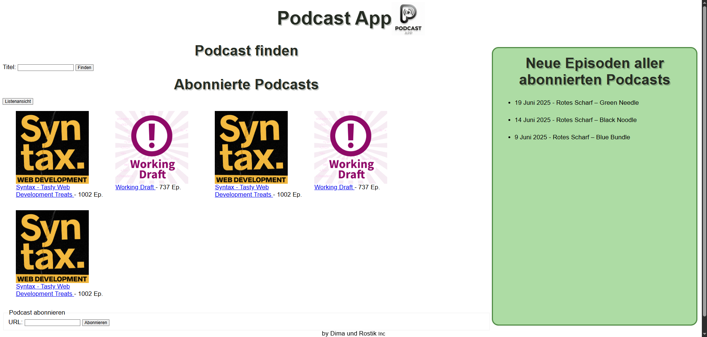
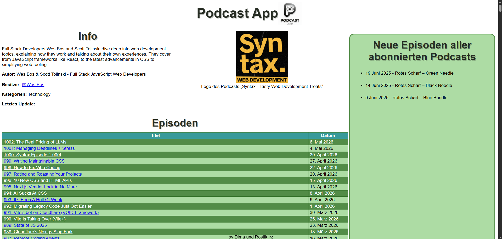
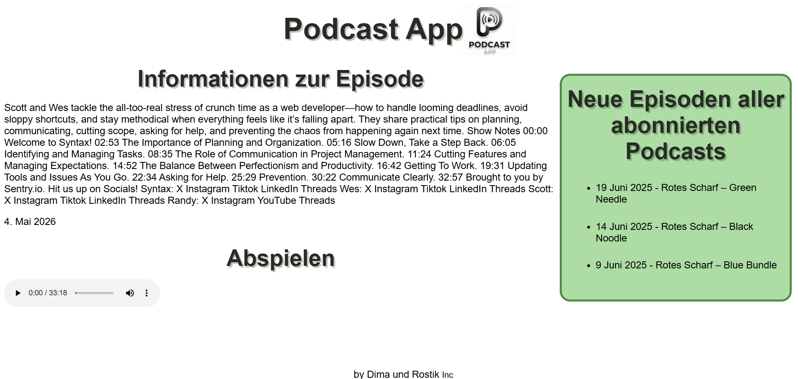

# Podcast Site

## About
Simple web app for podcasts. You can add, view and listen to podcasts.

## Tech stack
- Node.js
- Express
- JavaScript
- HTML, CSS

## Setup

Clone the repo:
```bash
git clone https://github.com/Herus1111/Podcast-Site-WEB.git

## How to run

npm install

node app.js

or

node server.js

(depending on the main file)

## Screenshots

### Main page


### Podcast info


### Episode info
